# Hermes — Distributed LLM Inference Gateway

Production-style async API gateway for routing requests across multiple Ollama backends with circuit breakers, rate limiting, and SSE streaming. Built for Apple Silicon. $0 budget. Fully local.

---

## What it does

Hermes sits in front of multiple local Ollama instances and intelligently routes LLM inference requests. It protects backends with per-backend circuit breakers, enforces rate limits via Redis token buckets, queues requests by priority tier, and streams responses via SSE.

---

## Why it matters

Running multiple LLM backends locally requires more than just a load balancer. You need fault isolation (circuit breakers), traffic shaping (rate limiting), quality-of-service (priority queues), and real-time observability. Hermes solves the exact infrastructure problem that production LLM serving platforms solve — without any cloud dependency.

---

## Architecture

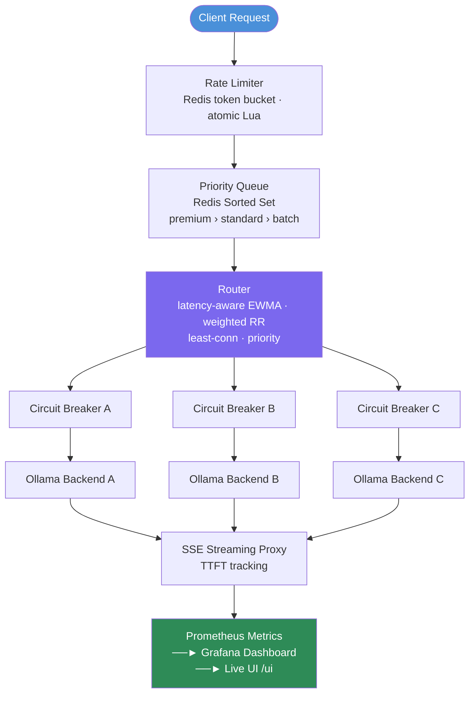

**Circuit breaker states**: `CLOSED` (normal) → `OPEN` (failing, reject fast) → `HALF_OPEN` (probe) → `CLOSED`

---

## Features

- **4 routing strategies**: latency-aware (EWMA), weighted round-robin, least-connections, priority-based
- **Per-backend circuit breakers**: CLOSED / OPEN / HALF_OPEN lifecycle with configurable thresholds
- **Redis token bucket rate limiting**: atomic Lua script, per-tier enforcement (premium / standard / batch)
- **Priority queue**: Redis Sorted Set; premium requests never starved by batch traffic
- **SSE streaming proxy**: full streaming pass-through with Time-To-First-Token (TTFT) tracking
- **Health checking**: async background loop with EWMA latency tracking per backend
- **Prometheus metrics**: counters, histograms, and gauges across all components
- **Grafana dashboards**: pre-configured dashboard for routing and backend health
- **Live dashboard UI**: real-time status at `/ui` (single HTML file, no frontend build needed)
- **Load testing**: Locust load test suite
- **Chaos testing**: automated backend failure injection

> **Note**: The priority queue module is fully implemented and tested, but priority-aware routing is not yet active in the default request path. The router currently uses latency-aware or round-robin strategies by default. Priority routing is available as an opt-in strategy via `/admin/routing/strategy`.

---

## Tech Stack

Python · FastAPI · Redis · Ollama · Prometheus · Grafana · Docker · Locust · asyncio · SSE

---

## Quickstart

### 1. Install dependencies

```bash
cd hermes
pip install -r requirements.txt
```

### 2. Start Redis

```bash
cd hermes
docker run -d -p 6379:6379 redis:7-alpine
```

### 3. Start Ollama backends (optional — gateway works without them)

```bash
cd hermes
chmod +x scripts/start_ollama.sh
./scripts/start_ollama.sh
```

### 4. Start Hermes

```bash
cd hermes
uvicorn gateway.main:app --reload --host 0.0.0.0 --port 8000
```

### 5. Open dashboard

```
http://localhost:8000/ui
```

### Full Docker stack

```bash
cd hermes
docker compose up --build
# Prometheus: http://localhost:9090
# Grafana:    http://localhost:3000
```

---

## API / CLI Usage

### Endpoints

| Endpoint | Method | Description |
|---|---|---|
| `/v1/chat/completions` | POST | Chat completions (OpenAI-compatible) |
| `/v1/completions` | POST | Text completions |
| `/health` | GET | Health check |
| `/status` | GET | Full gateway status |
| `/metrics` | GET | Prometheus metrics |
| `/ui` | GET | Live dashboard |
| `/admin/routing/strategy` | POST | Change routing strategy |
| `/admin/circuit-breaker/{id}/open` | POST | Force trip circuit breaker |
| `/admin/circuit-breaker/{id}/close` | POST | Force close circuit breaker |
| `/admin/queue/depth` | GET | Queue depth by tier |
| `/admin/rate-limit/reset` | POST | Reset rate limit bucket |

### Example: Chat completion

```bash
curl -X POST http://localhost:8000/v1/chat/completions \
  -H "Content-Type: application/json" \
  -H "X-Priority: premium" \
  -d '{"model": "llama3.2", "messages": [{"role": "user", "content": "Hello"}]}'
```

### Example: Force trip a circuit breaker

```bash
curl -X POST http://localhost:8000/admin/circuit-breaker/backend_0/open
```

### Example: Change routing strategy

```bash
curl -X POST http://localhost:8000/admin/routing/strategy \
  -H "Content-Type: application/json" \
  -d '{"strategy": "least_connections"}'
```

---

## Tests

```bash
# Run all tests (no Ollama or Redis needed)
pytest tests/ -v

# Run with coverage
pytest tests/ -v --cov=gateway
```

38+ tests covering: routing strategies, circuit breaker state machine, rate limiter, priority queue, health checker, streaming, and metrics.

---

## Observability

**Prometheus metrics** (available at `/metrics`):

- `hermes_requests_total{backend, status}` — request count by backend and outcome
- `hermes_request_duration_seconds{backend}` — request latency histogram
- `hermes_circuit_breaker_state{backend}` — circuit breaker state gauge
- `hermes_rate_limit_rejected_total{tier}` — rate limit rejections by tier
- `hermes_queue_depth{tier}` — priority queue depth by tier
- `hermes_backend_latency_ewma_ms{backend}` — EWMA latency per backend

**Grafana**: Pre-configured dashboard available. Import from `docs/` or use `docker compose up` to auto-provision.

---

## Demo

```bash
# Navigate to hermes directory
cd hermes

# 1. Start Hermes
uvicorn gateway.main:app --host 0.0.0.0 --port 8000

# 2. Send a request
curl http://localhost:8000/health

# 3. Check gateway status (routing strategy, backend health, queue depth)
curl http://localhost:8000/status | python -m json.tool

# 4. Force a circuit breaker open (chaos test)
curl -X POST http://localhost:8000/admin/circuit-breaker/backend_0/open

# 5. Watch automatic recovery (HALF_OPEN probe after timeout)
watch -n 2 "curl -s http://localhost:8000/status | python -m json.tool"

# 6. Load test
locust -f load_tests/locustfile.py --host http://localhost:8000

# 7. Chaos test (automated backend kill/restart)
python load_tests/chaos.py
```

---

## File Structure

```
hermes/
├── gateway/
│   ├── main.py           # FastAPI app + all routes
│   ├── router.py         # 4 routing strategies
│   ├── circuit_breaker.py# CLOSED/OPEN/HALF_OPEN state machine
│   ├── rate_limiter.py   # Redis token bucket (Lua atomic)
│   ├── queue.py          # Priority queue (Redis Sorted Set)
│   ├── health.py         # Async background health checker
│   ├── streaming.py      # SSE streaming proxy
│   ├── models.py         # Pydantic request/response schemas
│   └── metrics.py        # Prometheus metrics registry
├── config/               # Configuration files
├── ui/                   # Live dashboard (single HTML file)
├── tests/                # 38+ pytest tests
├── load_tests/           # Locust + chaos tests
├── scripts/              # Setup helpers
├── docs/
│   └── build-notes/      # Internal build notes (not public-facing)
├── docker-compose.yml
├── Dockerfile
└── prometheus.yml
```

---

## Known Limitations

- **Priority queue not default**: The priority queue module is implemented and tested but not yet active in the default request path. Requests currently flow through latency-aware or round-robin routing unless priority strategy is explicitly selected.
- **Ollama dependency**: Full end-to-end demos require at least one local Ollama instance running. The gateway returns graceful errors without Ollama, but actual inference requires it.
- **Redis required for rate limiting**: The token bucket rate limiter requires Redis. Without Redis, rate limiting is disabled and the gateway runs in degraded mode.
- **Single-machine design**: Hermes is designed for local multi-backend routing on one machine. It is not a distributed proxy.
- **No TLS**: No HTTPS support in the current implementation. Add a reverse proxy (nginx/Caddy) for production use.

---

## Future Work

- Wire priority queue into the default routing path as a first-class strategy
- Add request tracing (OpenTelemetry)
- Add per-model-id rate limiting (currently per-tier only)
- Support non-Ollama backends (OpenAI-compatible endpoints)
- Add HTTPS / mTLS support

---

## Screenshots

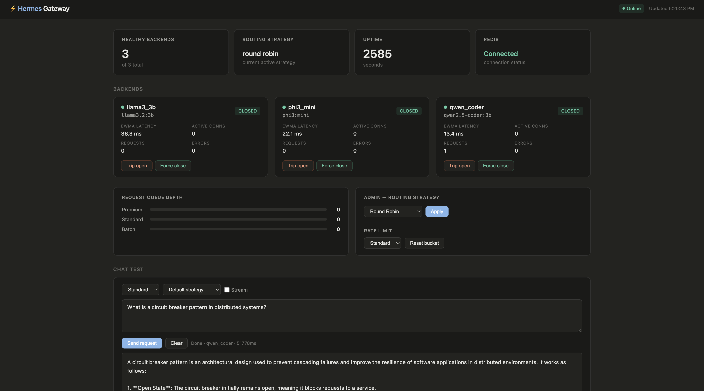
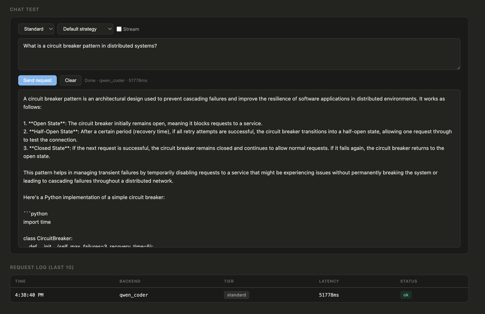
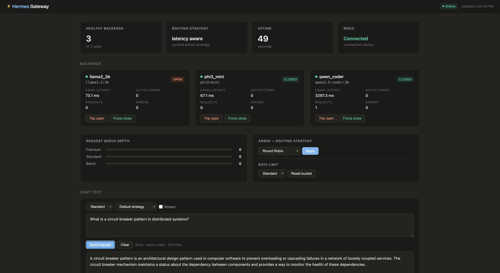
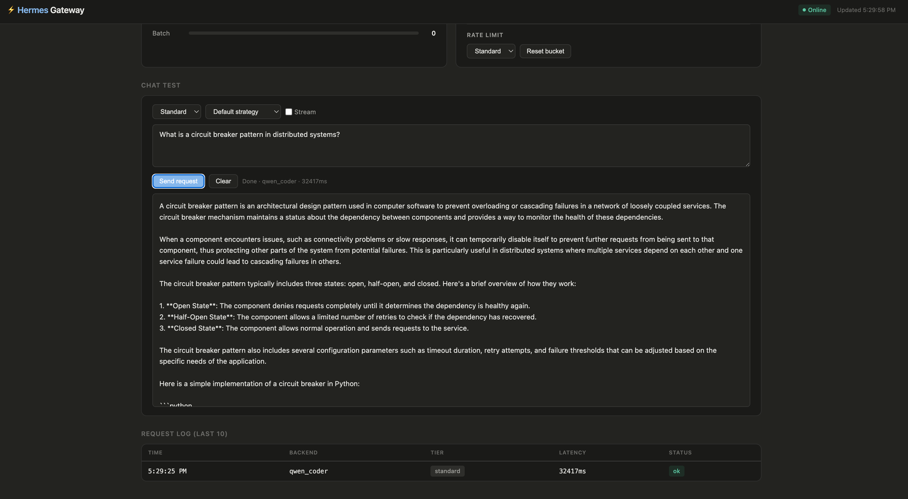
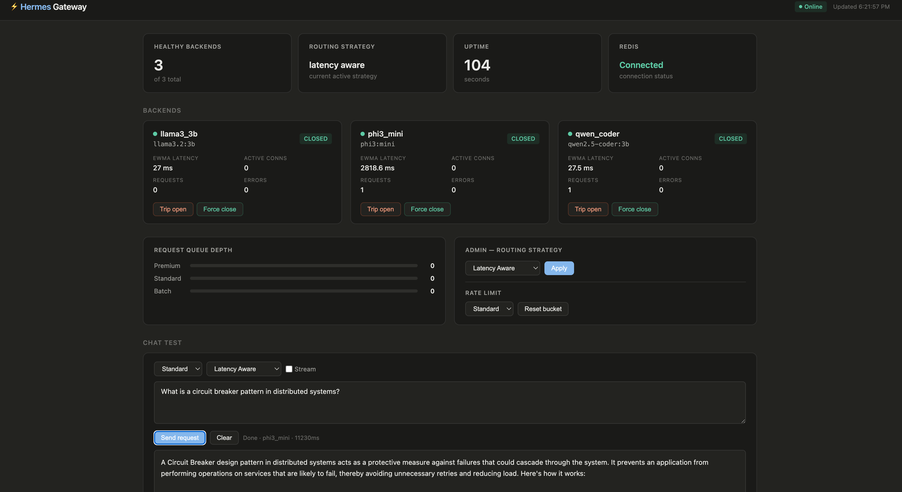
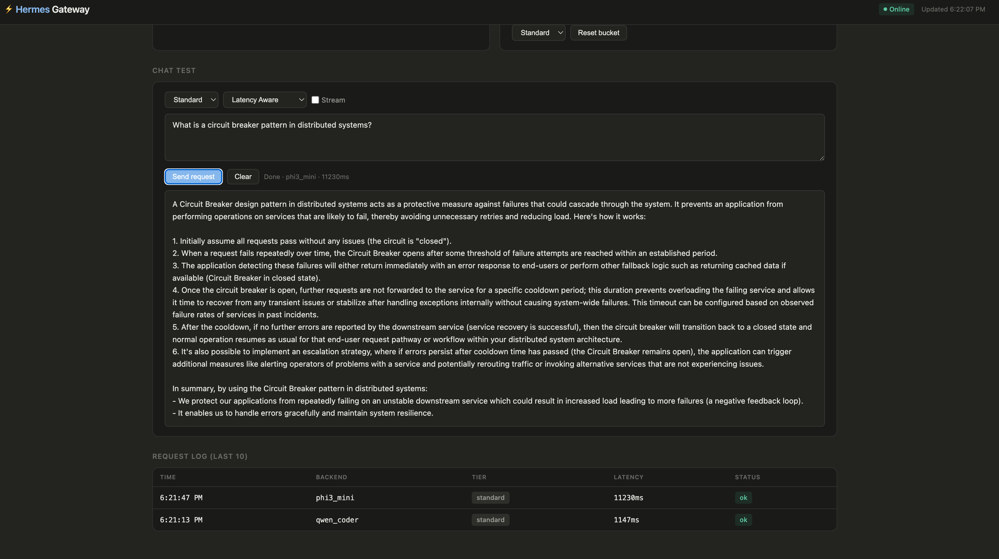
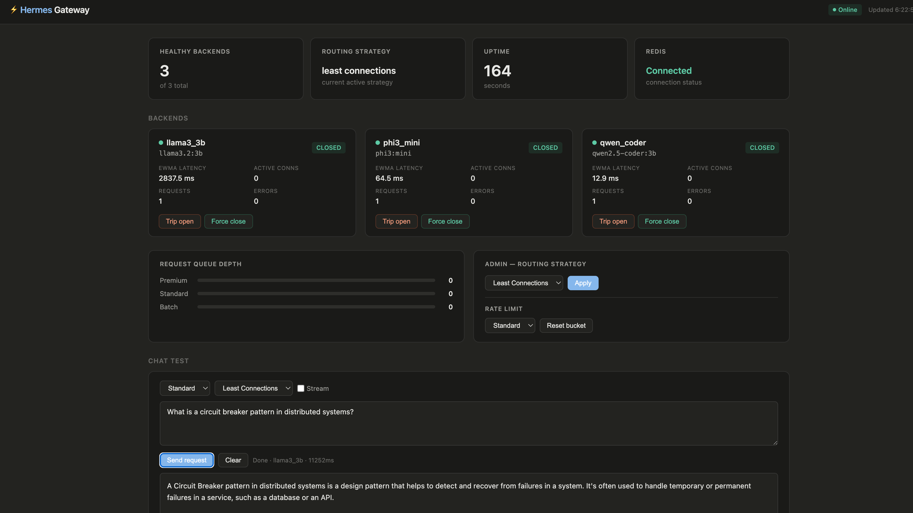
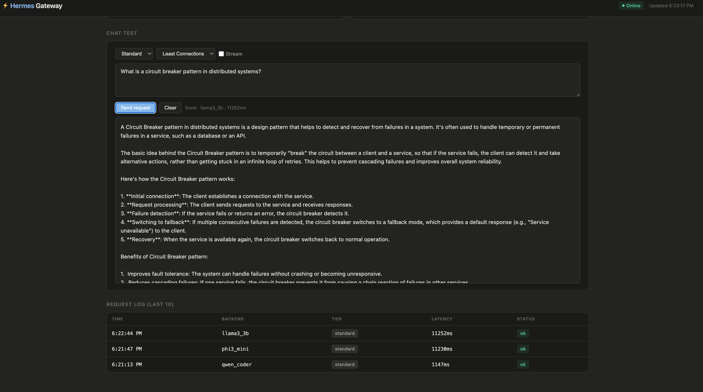
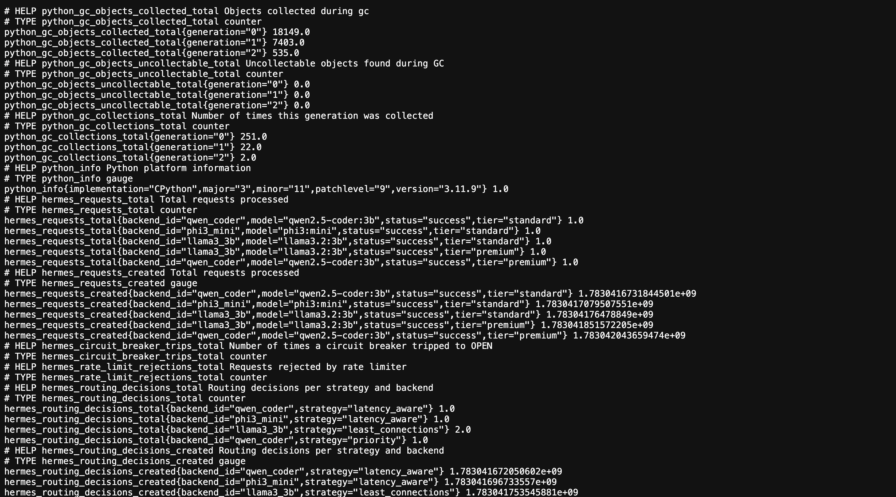
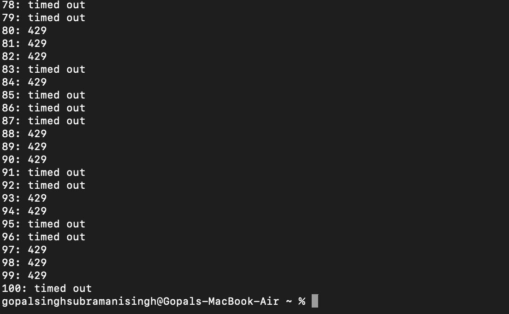
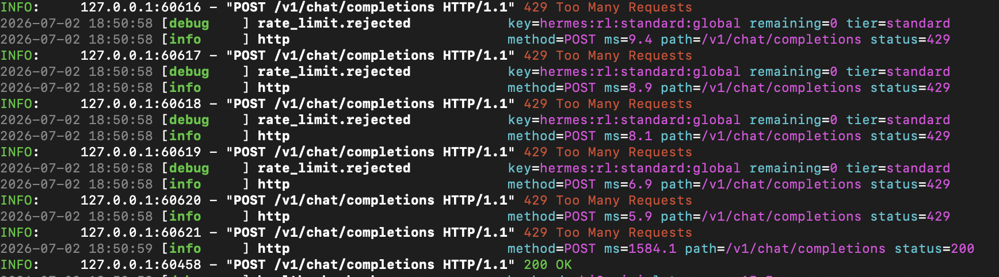
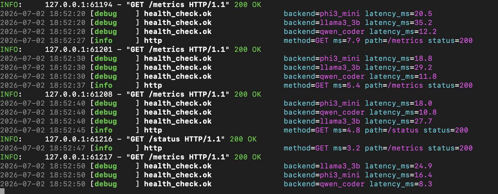
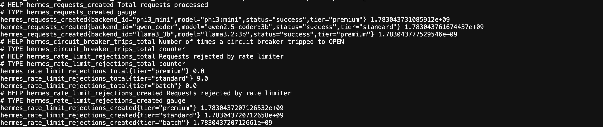
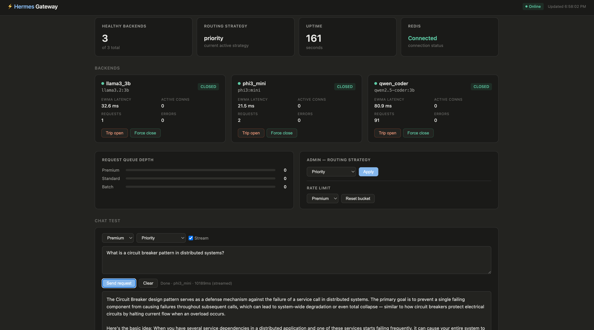
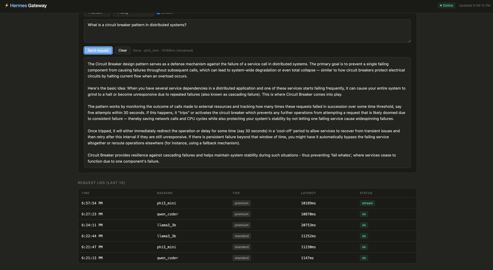
