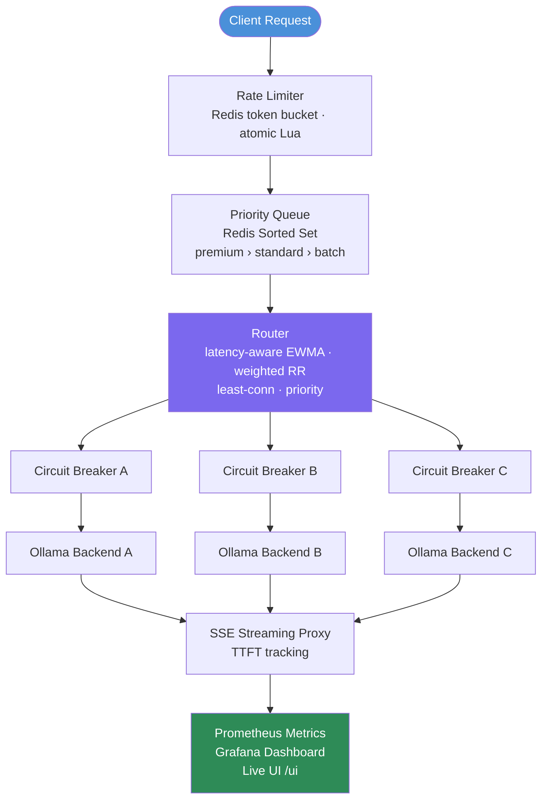

<p align="center">
  
</p>

<h1 align="center">Hermes</h1>

<p align="center">
  <strong>Distributed LLM Inference Gateway</strong>
</p>

<p align="center">
  Production-style async API gateway for routing requests across multiple local Ollama backends
  with circuit breakers, Redis rate limiting, SSE streaming, and Prometheus/Grafana observability.
</p>

<p align="center">
  
  
  
  
  
</p>

---

## Overview

**Hermes** is a local-first LLM inference gateway for routing requests across multiple Ollama backends.

It sits in front of local model servers and provides infrastructure features normally found in production LLM serving platforms:

* routing strategy selection
* backend health checks
* circuit breaker protection
* Redis-backed rate limiting
* priority-aware request handling
* SSE streaming
* Prometheus metrics
* Grafana dashboards
* live browser dashboard at `/ui`

Hermes is designed to demonstrate the systems layer behind reliable LLM inference serving without requiring cloud infrastructure.

---

## Why It Matters

Running multiple LLM backends locally requires more than a basic load balancer.

A real inference gateway needs to handle:

* backend failures
* slow or degraded model servers
* overloaded request paths
* rate-limit enforcement
* premium versus batch traffic
* streaming response delivery
* live service observability
* failure recovery after outages

Hermes implements these production-style patterns in a fully local Apple Silicon-friendly system.

---

## Architecture



Circuit breaker lifecycle:

```text
CLOSED → OPEN → HALF_OPEN → CLOSED
```

---

## Features

* **Four routing strategies**: latency-aware EWMA, weighted round-robin, least-connections, and priority-based routing
* **Per-backend circuit breakers** with `CLOSED`, `OPEN`, and `HALF_OPEN` states
* **Redis token bucket rate limiting** using an atomic Lua script
* **Priority queue module** backed by Redis Sorted Sets
* **SSE streaming proxy** with Time-To-First-Token tracking
* **Async backend health checks** with EWMA latency tracking
* **OpenAI-compatible chat and completion endpoints**
* **Admin endpoints** for routing strategy and circuit breaker control
* **Prometheus metrics** for request counts, latency, rate-limit rejections, circuit breaker state, queue depth, and backend latency
* **Grafana dashboard** for gateway and backend observability
* **Live dashboard UI** at `/ui`
* **Locust load testing** for traffic simulation
* **Chaos testing script** for backend failure injection

> **Priority queue note:** The priority queue module is implemented and tested, but it is not yet active in the default request path. The default gateway flow uses latency-aware or round-robin routing unless priority routing is explicitly selected through `/admin/routing/strategy`.

---

## Tech Stack

| Area          | Tools                        |
| ------------- | ---------------------------- |
| API Gateway   | FastAPI, asyncio             |
| LLM Backend   | Ollama                       |
| Rate Limiting | Redis, Lua token bucket      |
| Queueing      | Redis Sorted Sets            |
| Streaming     | Server-Sent Events           |
| Metrics       | Prometheus                   |
| Dashboard     | Grafana, single-file HTML UI |
| Testing       | pytest, Locust               |
| Runtime       | Docker, Docker Compose       |

---

## Quickstart

### 1. Install dependencies

```bash
cd hermes
pip install -r requirements.txt
```

### 2. Start Redis

```bash
docker run -d -p 6379:6379 redis:7-alpine
```

### 3. Start Ollama backends

The gateway can start without Ollama, but real inference requires at least one local Ollama backend.

```bash
chmod +x scripts/start_ollama.sh
./scripts/start_ollama.sh
```

### 4. Start Hermes

```bash
uvicorn gateway.main:app --reload --host 0.0.0.0 --port 8000
```

### 5. Open the live dashboard

```text
http://localhost:8000/ui
```

### 6. Run the full Docker stack

```bash
docker compose up --build
```

Prometheus:

```text
http://localhost:9090
```

Grafana:

```text
http://localhost:3000
```

---

## API Endpoints

| Method | Endpoint                            | Description                                                |
| ------ | ----------------------------------- | ---------------------------------------------------------- |
| POST   | `/v1/chat/completions`              | OpenAI-compatible chat completions                         |
| POST   | `/v1/completions`                   | Text completions                                           |
| GET    | `/health`                           | Health check                                               |
| GET    | `/status`                           | Gateway status, routing state, backend health, queue depth |
| GET    | `/metrics`                          | Prometheus metrics                                         |
| GET    | `/ui`                               | Live dashboard                                             |
| POST   | `/admin/routing/strategy`           | Change routing strategy                                    |
| POST   | `/admin/circuit-breaker/{id}/open`  | Force-open a circuit breaker                               |
| POST   | `/admin/circuit-breaker/{id}/close` | Force-close a circuit breaker                              |
| GET    | `/admin/queue/depth`                | Queue depth by tier                                        |
| POST   | `/admin/rate-limit/reset`           | Reset rate-limit buckets                                   |

---

## Example Usage

### Chat completion

```bash
curl -X POST http://localhost:8000/v1/chat/completions \
  -H "Content-Type: application/json" \
  -H "X-Priority: premium" \
  -d '{"model": "llama3.2", "messages": [{"role": "user", "content": "Hello"}]}'
```

### Check gateway status

```bash
curl http://localhost:8000/status | python -m json.tool
```

### Force-open a circuit breaker

```bash
curl -X POST http://localhost:8000/admin/circuit-breaker/backend_0/open
```

### Change routing strategy

```bash
curl -X POST http://localhost:8000/admin/routing/strategy \
  -H "Content-Type: application/json" \
  -d '{"strategy": "least_connections"}'
```

---

## Observability

Hermes exposes Prometheus metrics at:

```text
http://localhost:8000/metrics
```

### Prometheus Metrics

| Metric                                     | Description                           |
| ------------------------------------------ | ------------------------------------- |
| `hermes_requests_total{backend, status}`   | Request count by backend and outcome  |
| `hermes_request_duration_seconds{backend}` | Request latency histogram             |
| `hermes_circuit_breaker_state{backend}`    | Circuit breaker state gauge           |
| `hermes_rate_limit_rejected_total{tier}`   | Rate-limit rejections by traffic tier |
| `hermes_queue_depth{tier}`                 | Priority queue depth by tier          |
| `hermes_backend_latency_ewma_ms{backend}`  | EWMA latency per backend              |

Grafana dashboards are available through Docker Compose or by importing dashboard files from the repository.

---

## Demo

```bash
# 1. Start Hermes
uvicorn gateway.main:app --host 0.0.0.0 --port 8000

# 2. Check health
curl http://localhost:8000/health

# 3. Check gateway status
curl http://localhost:8000/status | python -m json.tool

# 4. Force a circuit breaker open
curl -X POST http://localhost:8000/admin/circuit-breaker/backend_0/open

# 5. Watch automatic recovery
watch -n 2 "curl -s http://localhost:8000/status | python -m json.tool"

# 6. Load test
locust -f load_tests/locustfile.py --host http://localhost:8000

# 7. Chaos test
python load_tests/chaos.py
```

---

## File Structure

```text
hermes/
├── gateway/
│   ├── main.py            # FastAPI app and routes
│   ├── router.py          # Routing strategies
│   ├── circuit_breaker.py # CLOSED/OPEN/HALF_OPEN state machine
│   ├── rate_limiter.py    # Redis token bucket with Lua
│   ├── queue.py           # Priority queue using Redis Sorted Sets
│   ├── health.py          # Async backend health checker
│   ├── streaming.py       # SSE streaming proxy
│   ├── models.py          # Pydantic schemas
│   └── metrics.py         # Prometheus metrics registry
├── config/                # Gateway configuration
├── ui/                    # Single-file live dashboard
├── tests/                 # Pytest test suite
├── load_tests/            # Locust and chaos tests
├── scripts/               # Setup helpers
├── docs/                  # Screenshots and notes
├── docker-compose.yml
├── Dockerfile
└── prometheus.yml
```

---

## Screenshots


---

## Tests

```bash
pytest tests/ -v
```

With coverage:

```bash
pytest tests/ -v --cov=gateway
```

The test suite covers routing strategies, circuit breaker lifecycle, rate limiting, priority queue behavior, health checks, streaming, and metrics.

---

## Known Limitations

* **Priority queue not active by default**: The priority queue module is implemented and tested but not yet wired into the default request path.
* **Ollama required for inference**: End-to-end inference requires one or more local Ollama instances.
* **Redis required for rate limiting**: Without Redis, rate limiting runs in degraded mode or is unavailable depending on configuration.
* **Single-machine design**: Hermes targets local multi-backend routing on one machine, not a distributed proxy cluster.
* **No TLS support**: HTTPS/mTLS should be handled by a reverse proxy such as nginx or Caddy for production-style deployment.

---

## Future Work

* Wire priority queue into the default request path
* Add OpenTelemetry tracing
* Add per-model rate limiting
* Support non-Ollama OpenAI-compatible backends
* Add HTTPS and mTLS deployment examples
